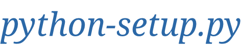

  语言:
    🇨🇳
  <a title="英语" href="./README.en.md">🇺🇸</a>
  <!-- <a title="俄语" href="../ru/README.md">🇷🇺</a> -->

 

  «python-setup.py» 展示了如何进行Python程序打包
 
 
  
  
  
  

* [打包和分发Python程序](https://zj-image-processing.readthedocs.io/zh_CN/latest/python/%E6%89%93%E5%8C%85%E5%92%8C%E5%88%86%E5%8F%91Python%E7%A8%8B%E5%BA%8F/)

## 内容列表

- [内容列表](#内容列表)
- [主要维护人员](#主要维护人员)
- [致谢](#致谢)
- [参与贡献方式](#参与贡献方式)
- [许可证](#许可证)

## 主要维护人员

* zhujian - *Initial work* - [zjykzj](https://github.com/zjykzj)

## 致谢

* [facebookresearch/detectron2](https://github.com/facebookresearch/detectron2)
* [navdeep-G/setup.py](https://github.com/navdeep-G/setup.py/blob/master/setup.py)

## 参与贡献方式

欢迎任何人的参与！打开[issue](https://github.com/zjykzj/python-setup.py/issues)或提交合并请求。

注意:

* `GIT`提交，请遵守[Conventional Commits](https://www.conventionalcommits.org/en/v1.0.0-beta.4/)规范
* 语义版本化，请遵守[Semantic Versioning 2.0.0](https://semver.org)规范
* `README`编写，请遵守[standard-readme](https://github.com/RichardLitt/standard-readme)规范

## 许可证

[Apache License 2.0](LICENSE) © 2020 zjykzj